        
---

## A. Project Overview

**AI Study Companion** is a project-centric learning platform. A user creates **Spaces** (folders), inside them **Projects** (e.g. "Thermodynamics"), uploads **PDF learning materials** to a project, and then learns through a **project-scoped AI Tutor** (grounded Q&A with citations), **Adaptive Quizzes** (MCQ + open-ended), **Concept Mastery tracking**, **Growth analysis**, and **Next-action recommendations**.

**Problem solved:** generic chatbots answer from the open internet and forget you. Students need answers grounded in *their own materials*, tied to *their* concepts, with memory of *their* progress across sessions.

### The learning loop (as implemented)

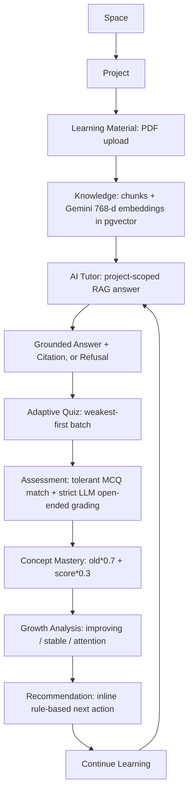

---

## B. Technology Stack

| Layer | Technology | Purpose |
| ----- | ---------- | ------- |
| Frontend | React 18.3 + Vite 5 (`frontend/package.json`) | SPA, `vite build` → `dist/` |
| Frontend state | Redux Toolkit + react-redux | Per-domain slices (`features/*/`) |
| Frontend routing | react-router-dom v6 | Routes in `src/App.jsx:73-95` |
| HTTP client | axios (`src/api/client.js`) | `VITE_API_BASE_URL`, Bearer interceptor |
| Styling | Tailwind CSS 3 + Framer Motion + react-markdown | UI, animations, Markdown answers |
| Backend | FastAPI + uvicorn (`backend/requirements.txt`) | REST API, `app/main.py` |
| Auth | python-jose HS256 JWT (7-day) + bcrypt (`app/core/security.py`) | Login, Bearer guard |
| ORM / validation | SQLAlchemy + Pydantic v2 / pydantic-settings | Models, schemas, env config |
| Database | PostgreSQL 15 + pgvector (Neon in prod) | All tables + `Vector(768)` chunks |
| Migrations | None — `Base.metadata.create_all` + idempotent `ALTER TABLE ... IF NOT EXISTS` (`app/main.py`) | Boot-time schema |
| Chat LLM (active) | Inception Labs Mercury (`mercury-2.5`) via OpenAI-compatible `ChatOpenAI` (`app/ai/llm.py:12-21`) | Tutor, quiz, concepts, grading |
| Chat LLM (standby) | Groq `ChatGroq` (`app/ai/llm.py:24-25`) | Fallback when `GROQ_API_KEY` set |
| Dev fallback | `FakeMessagesListChatModel` | "temporarily unavailable" when no key |
| Embeddings | Google Gemini `gemini-embedding-001`, 768-d (`document_tasks.py:49`, `tutor_nodes.py:352-356`) | Ingest + retrieval query vectors |
| LangChain | `langchain`, `langchain-core`, `langchain-openai`, `langchain-groq`, `langchain-google-genai`, `langchain-text-splitters` | LLM wrappers, embeddings, `RecursiveCharacterTextSplitter(1000/150)`, messages/prompts, strict-JSON parsing |
| LangGraph | `langgraph`, `langgraph-checkpoint-postgres` | `StateGraph` tutor/quiz/assignment graphs; Postgres checkpointer (tutor, quiz), `MemorySaver` (assignment) |
| Vector search | pgvector cosine distance, top-5 (`tutor_nodes.py:360-366`, `quiz_nodes.py:49-55`) | Project-filtered retrieval |
| PDF processing | PyMuPDF + Pillow + pytesseract + `tesseract-ocr` binary (`Dockerfile`) | `parse_pdf()` per-page text with 300-DPI OCR fallback (`app/utils/pdf_parser.py`) |
| Background jobs | Celery + Redis (`app/tasks/celery_app.py`) | `documents.process`, `concepts.extract`, quiz/assignment/learning tasks; retries 2–3, `acks_late`, idempotency guards |
| Containers | Docker (`backend/Dockerfile` python:3.11-slim; `frontend/Dockerfile` node:18-alpine dev) + `docker-compose.yml` (backend, worker, redis, frontend) | Local + Railway backend |
| Deployment | Railway (backend, honors `$PORT`), Vercel (frontend SPA, `vercel.json` rewrites) | Prod hosting |
| Observability | loguru + `TrackedLLM`/`track_ai_call` → `ai_usage` table (`app/services/ai_usage_service.py`) + optional LangSmith passthrough | Model, feature, latency, tokens, cost, success; Admin → AI Usage / AI Evaluation |

Not used (do not assume): no Alembic, no OAuth, no streaming/SSE, no app cache, no pagination on major lists, no rate limiting, no S3/object storage, no Prometheus/Sentry. ColiVara visual-RAG helpers exist as an uncalled `[DEMO]` stub (`app/services/document_retrieval_service.py`) with call sites commented out.

---

## C. High-Level Architecture

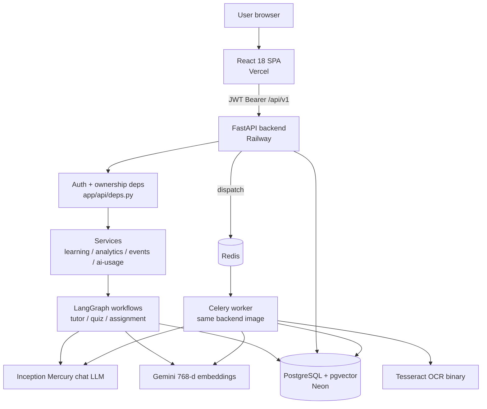

Request path: `User → React → FastAPI router → get_current_user/get_owned_* → service/graph → pgvector + LLM → response + ai_usage row`. Writes that need AI/heavy work (ingest, grading, batch quiz generation, summaries) return fast and finish in Celery.

---

## D. Frontend Architecture

Actual routes (`frontend/src/App.jsx:73-95`), all auth-guarded except login/register; `/admin` additionally requires `role === 'admin'`:

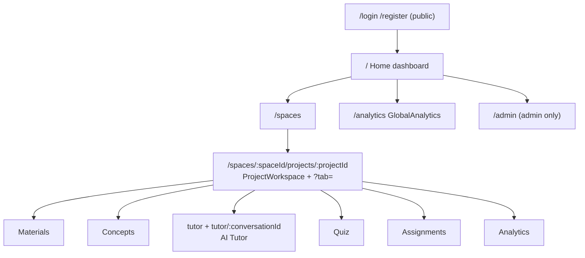

Structure: `src/api/client.js` (baseURL + token interceptor) → `features/{auth,project,tutor,quiz,assignments,concepts,analytics}/*Api.js|*Slice.js` → `store/store.js` → `pages/` + shared `components/{Navbar,Sidebar,ui,icons,ConfirmModal}`. API mapping: auth `POST /auth/login|register`, `GET /auth/me`; spaces/projects CRUD under `/spaces/`; materials `POST .../upload-pdf`, `GET .../documents`, `.../evidence`, `.../retry`; tutor conversations CRUD + `POST .../conversations/:cid/tutor {question, action?}` (+ legacy `POST .../tutor`); quiz `POST /projects/:pid/quiz/start`, `PATCH /quiz/:qid/questions/:qqid/save`, `POST /quiz/:qid/submit`; assignments + `GET .../:pid/concepts`; analytics `GET /analytics/overview`, `GET /spaces/:sid/projects/:pid/analytics`, `GET /admin/*`. There is **no Recommendations page/route/tab** — recommendations render inline inside Analytics.

---

## E. Backend Architecture

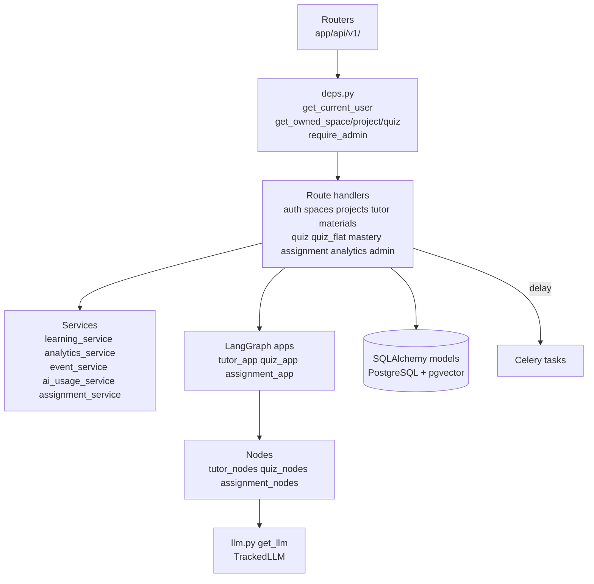

Separation: routers validate (Pydantic schemas in `app/schemas/`) and enforce ownership; services hold pure/reusable logic (growth math, memory rendering, events, metering); `app/ai/` holds prompts, graphs, nodes, concept extraction, mastery engine; `app/tasks/` holds background execution with retries; `app/db/models/` owns persistence. `app/api/v1/router.py` is dead code (never included in `main.py:133-143`).

---

## F. Database Architecture

All tables are created by `create_all` (no Alembic). pgvector `Vector(768)` on `document_chunks.embedding`.

`

Key fields: `User(id, email unique, hashed_password, name, role, is_active)`; `Space(user_id FK CASCADE)`; `Project(space_id FK CASCADE, learning_goal, overall_progress)`; `Document(project_id, file_name, file_path, file_hash(64), status queued|processing|ready|failed)`; `DocumentChunk(document_id, project_id, content, page_number, embedding)`; `ChatSession(project_id, title, is_active)` / `Message(chat_session_id, role, content, citations JSONB, suggested_questions JSONB)`; `Concept(project_id, document_id SET NULL, name, description, mastery_level, last_assessed_at)`; `Quiz(project_id, name, goal, status)` / `QuizQuestion(quiz_id, concept_id SET NULL, question_type, question_text, options JSONB, correct_answer, user_answer, evaluation JSONB)`; `Assignment(+concept_ids JSONB, status)` / `AssignmentQuestion` / `AssignmentSubmission(score, feedback JSONB)`; `UserConceptMastery(user,concept unique, mastery_score, last_feedback)`; `QuizHistory(user, concept SET NULL, question_text, is_correct)`; `MasteryHistory(user, project, concept, mastery, source quiz|chat|baseline, source_id, unique(concept,source,source_id))`; `LearningContext(user, project, type goal|preference|strength|weakness|repeated_mistake|tutor_context|user_fact, concept_id, content, confidence, source, source_id)`; `ConversationSummary(chat_session_id unique, summary, last_message_id)`; `AIUsage(feature, provider, model, latency_ms, success, error, user_id, project_id [no FKs], prompt/completion/total tokens, cost_usd, calls)`; `LearningEvent(user_id, project_id, type, text, event_key unique)`. There is **no recommendations table** and **no separate events-bus table** beyond `LearningEvent`.

## H. Document Processing Architecture

Actual pipeline (`materials.py:101-178` → `document_tasks.py:27-103` → `concept_tasks.py:16-95`):

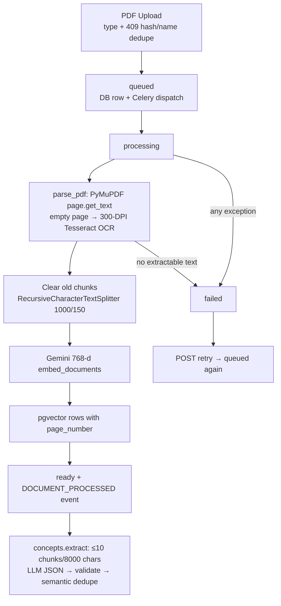

Notes: 1-MB chunked file writes; no file-size cap or MIME sniffing beyond extension/content-type; filename is not `basename`-sanitized (known gap); per-page OCR failure returns `""` so one bad page never fails the doc; empty-document honestly becomes `failed`; retry is idempotent (old chunks deleted before re-insert); concept insert starts at `mastery_level=0.0`. Tables/diagrams/charts have **no structural parsing** — only their text layer (or OCR text) is indexed; page numbers are preserved for citations.

---

## I. RAG Architecture

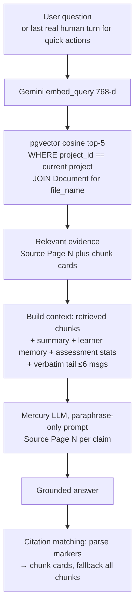

Insufficient evidence: `grade_documents` LLM yes/no gate fails open on provider error; `route_evidence` sends weak evidence to `reject_answer` (fixed message) except conversation-action turns; `generate_answer` prompt repeats the exact refusal sentence as last resort (`tutor_nodes.py:714-720`). Quiz generation reuses the same retrieval (`quiz_nodes._rag_context`, top-5, ≤6000 chars).

---

## K. LangChain Architecture

Used: `ChatOpenAI` (Inception Mercury, OpenAI-compatible), `ChatGroq` (fallback), `FakeMessagesListChatModel` (no-key fallback), `GoogleGenerativeAIEmbeddings`, `RecursiveCharacterTextSplitter`, `Human/System/AIMessage`, Pydantic strict-JSON parsing with 3-try repair loops.

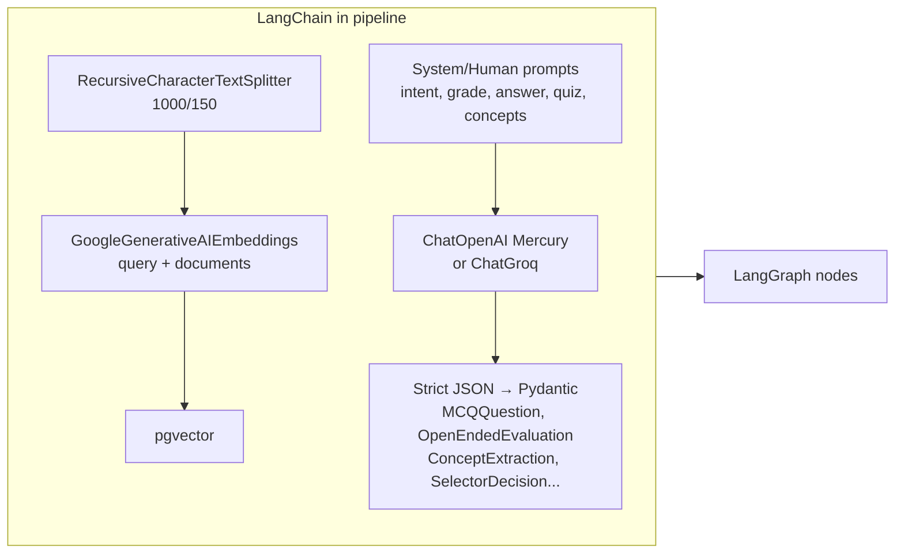

Every LLM object is wrapped in `TrackedLLM` (`app/ai/llm.py:30`), so invoke/ainvoke automatically records provider, model, tokens, latency into the current `track_ai_call` bucket.

---

## L. LangGraph Architecture

### Tutor graph (main workflow — `app/ai/graphs/tutor_graph.py:33-54`, Postgres checkpointer)

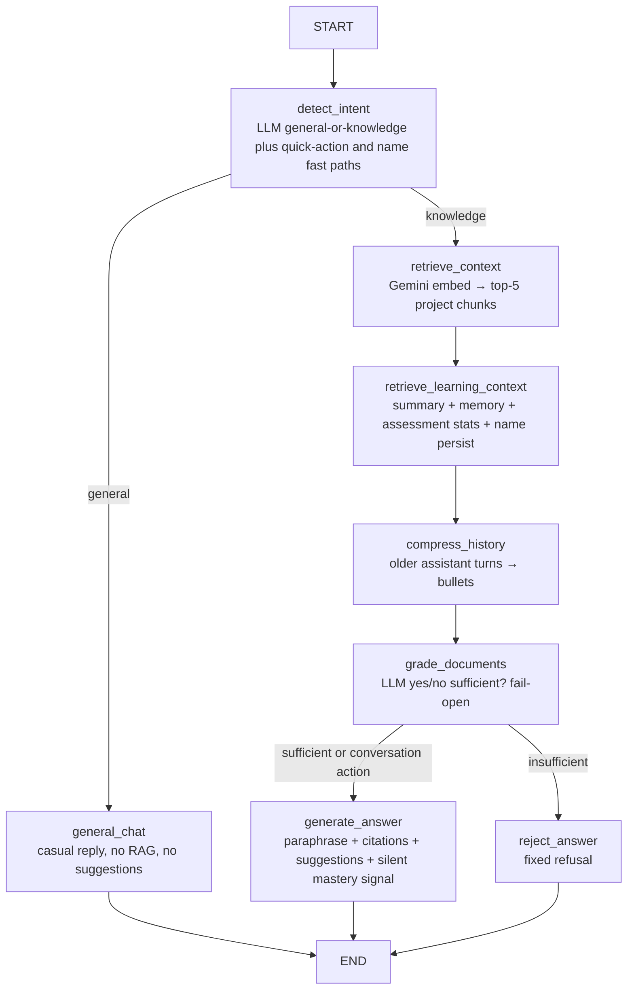

### Quiz graph (`quiz_graph.py`, Postgres checkpointer, `MAX_QUESTIONS=5`)

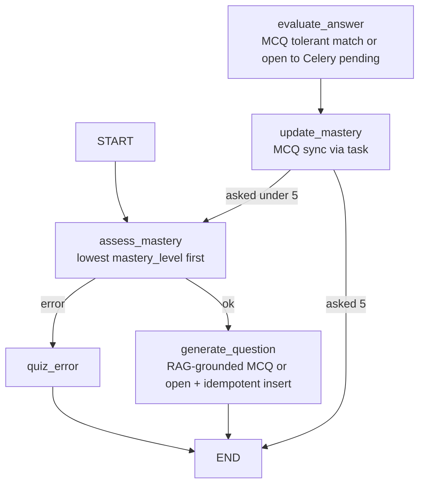

Note: the UI's live flow uses **batch** helpers (`generate_quiz_batch` + `evaluate_submission_task`), not the one-by-one interrupt loop; the graph exists and is used by legacy/step routes.

### Assignment graph (`assignment_graph.py`, `MemorySaver`)

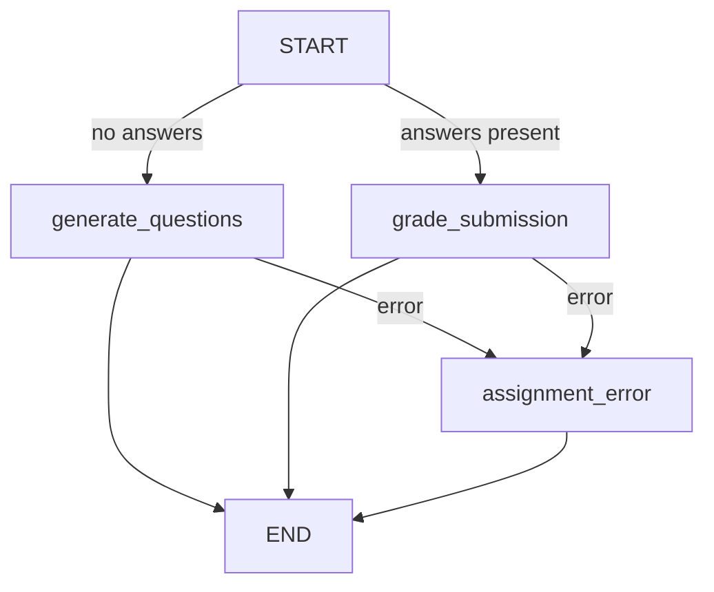

| Node | Purpose | Input | Output |
| ---- | ------- | ----- | ------ |
| `detect_intent` | LLM classify general vs knowledge; quick-action and name-question fast paths | `user_question`, `action_id` | `intent` |
| `general_chat` | Casual reply with name personalization, no RAG | history tail, `user_name` | `final_answer`, `messages` |
| `retrieve_context` | Gemini embed + pgvector top-5 project-filtered | `user_question` (+ last human turn for actions) | `retrieved_context`, `retrieved_sources` |
| `retrieve_learning_context` | Summary + memory lines + assessment stats + sync name persist | project/user IDs, session ID | `conversation_summary`, `relevant_learning_context`, `relevant_assessment_context`, `user_name` |
| `compress_history` | Older assistant turns → bullets when over budget | `messages` | `history_summary` |
| `grade_documents` | LLM yes/no sufficiency, fail-open | question + context | `sufficient_evidence` |
| `generate_answer` | Paraphrased cited Markdown + suggestions + silent chat mastery signal | everything above | `final_answer`, `citations`, `suggested_questions` |
| `reject_answer` | Fixed out-of-scope refusal | — | `final_answer`, empty citations/suggestions |
| `assess_mastery` | Pick lowest-mastery concept | `project_id` | `selected_concept(_id)` |
| `generate_question` | RAG-grounded MCQ/open + dedupe insert | concept | `current_question(_id)`, `question_type` |
| `evaluate_answer` | MCQ tolerant match / open → Celery | `user_answer` | `evaluation` |
| `update_mastery` | 70/30 via task (MCQ sync) + touch `last_assessed_at` | question ID | — |
| `generate_assignment_questions` / `grade_assignment_submission` | Assignment batch create / grade via `assignment_app` | prompt / answers | questions / score+feedback |

Persistence: tutor/quiz threads keyed by conversation/quiz ID in Postgres (`robust_ainvoke` resets stale checkpointer connections); assignment uses in-process `MemorySaver`. Errors: grader fails open; provider errors map to 429/502 at the route; batch tasks retry with terminal `failed` states.

---

## M. Adaptive Quiz Architecture

Live flow is **weakest-first batch**: `POST /projects/:pid/quiz/start {name, goal, num_mcq, num_open}` → `Quiz` row → Celery `generate_batch_task` → `generate_quiz_batch` → answers saved draft → `POST /quiz/:qid/submit` → `evaluate_submission_task` grades all → per-question mastery updates → `completed`.

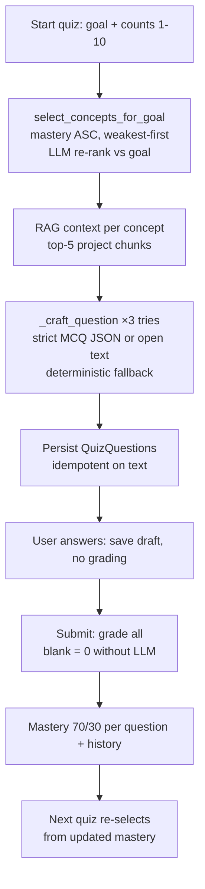

Adaptivity evidence used: `Concept.mastery_level` ordering, goal relevance re-rank, `last_assessed_at` tiebreak, round-robin across concepts, recent `QuizHistory` stats visible to tutor context. Per-question LLM selector (`mastery_engine.select_next_concept`, zone-of-proximal-development 30–70) exists but serves the unwired step-graph path, not the UI batch flow — documented gap, not hidden.

---

## N. Assessment Architecture

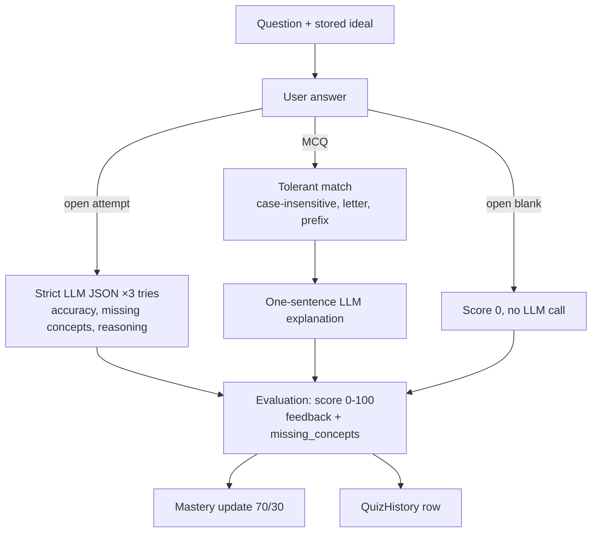

Open-ended grading is strict by prompt ("points only for demonstrated correctness, never effort/verbosity"); unanswered quiz questions count as 0 at submit so averages never inflate (`quiz_tasks.py:314-322`). Results (correct answers, evaluations) are revealed only after `completed` (`quiz_flat.py` serialization).

---

## O. Mastery + Growth Architecture

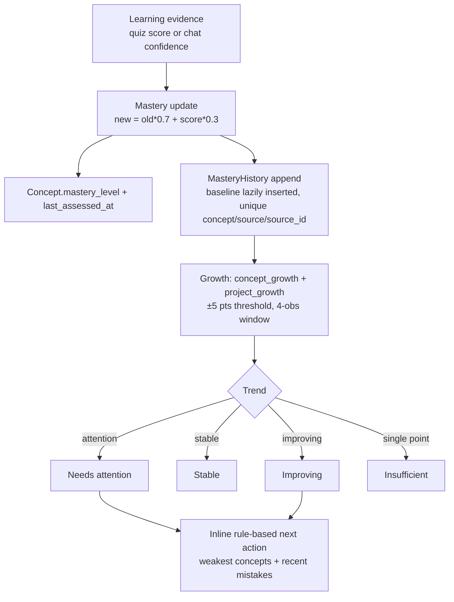

Three update paths share the same 70/30 math: quiz submit (`update_mastery_from_quiz_task`), single MCQ (`update_mastery` node), chat understanding signal (`update_mastery_from_chat_task`, skipped for `practice` turns). Display bands (frontend/docs): ≥70 Strong, 40–69 Learning, <40 Needs work. Mastery is an **estimate that evolves with evidence**, never a perfect measure — stated in prompts and docs.

---

## P. Persistent Learning Context

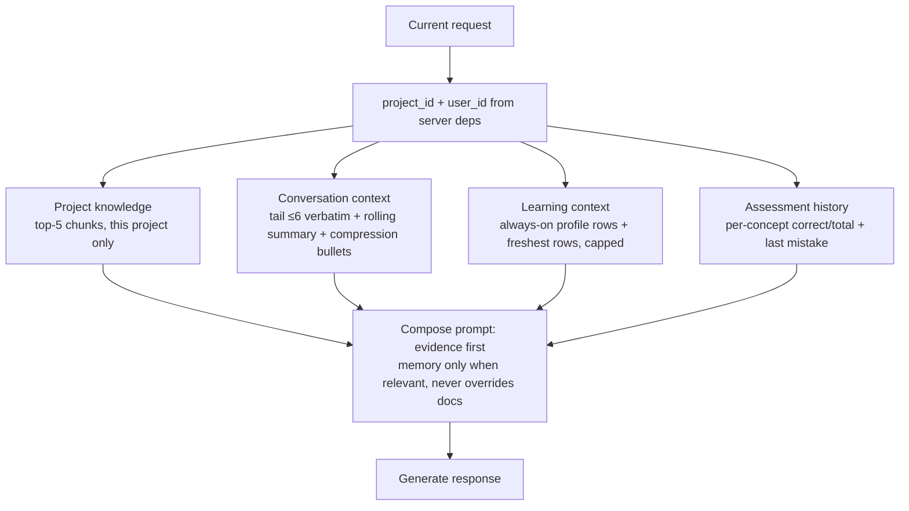

Storage: `LearningContext` typed rows (`goal|preference|strength|weakness|repeated_mistake|tutor_context|user_fact`) with confidence/source, written by `learning.extract_context` (name fast-path + LLM JSON + grounded `upsert_memory` + repeated-mistake mining) and read recency-first with caps (`ALWAYS_TYPE_CAP`, 50-row limit). Summaries via `learning.summarize_conversation` (threshold-gated: `should_summarize`, noise-filtered). Nothing ships full history to the LLM.

---

## Q. Event & Background Processing

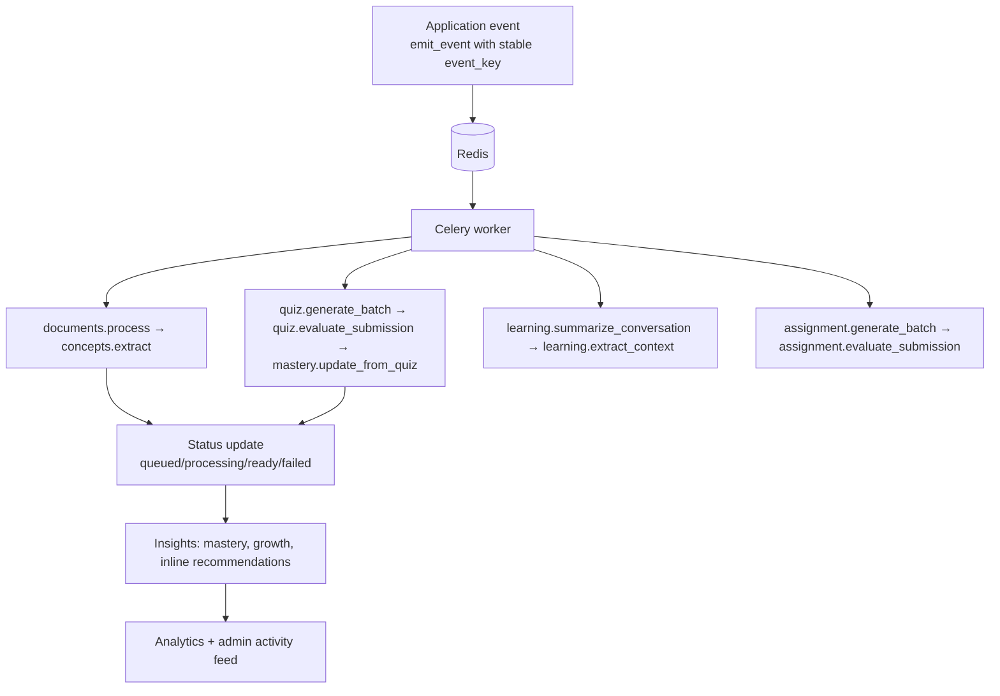

Concrete chains: `Material Upload → documents.process → extract_concepts_task`; `Quiz submit → evaluate each → mastery per question → QUIZ_COMPLETED event`; `Tutor turn → summarize + extract context (fire-and-forget)`; `Chat understanding → mastery.update_from_chat`. Guarantees: `acks_late + prefetch 1`, retries (documents: manual failed-state; concepts ×3; quiz ×2–3), idempotency (`event_key` unique, duplicate question-text reuse, already-evaluated/completed skips, chunk-clear before re-embed), terminal `failed` states surfaced in Admin → Jobs. PRD duplicate-job handling is satisfied by these guards.

---

## T. Observability

LangSmith is integrated for LLM tracing and evaluation visibility. The project also exposes AI usage information in the **Admin Dashboard → AI Usage / AI Evaluation**.

- LangSmith tracks LLM workflow execution and provides trace-level visibility.
- The Admin Dashboard shows AI usage such as provider, model, latency, tokens, cost, and success/error status.
- Background failures and document/quiz workflow status are surfaced in the Admin Dashboard.

---

## U. Architecture Decisions

| Decision | Why | Trade-off |
| -------- | --- | --------- |
| React 18 + Vite SPA on Vercel | Fast prototype SPA; `dist` static hosting with rewrites | No SSR/SEO; client-side data fetching only |
| FastAPI + JWT Bearer | Typed Python API, Pydantic validation, simple token auth | 7-day token, no refresh rotation |
| PostgreSQL + pgvector (Neon), single store | One database for relational + `Vector(768)` search; no extra vector service to operate | Cosine top-5 only; no hybrid/BM25, no index tuning documented |
| No Alembic (`create_all` + `IF NOT EXISTS` alters) | Zero-migration prototype velocity | Risky for concurrent deploys; no downgrade path |
| Inception Mercury primary, Groq standby, Gemini embeddings | Mercury for chat/reasoning via OpenAI-compatible API; Gemini 768-d matches `Vector(768)` | Two vendors + fallback pricing; Mercury cost is fallback-estimated |
| LangChain for LLM/embedding/chunking plumbing | Reuse wrappers, splitters, message types, strict-JSON patterns | Version churn surface; thin abstraction over direct SDKs |
| LangGraph with Postgres checkpointer (tutor/quiz) | Stateful multi-node flows (intent → retrieve → grade → answer) with per-thread persistence | Heavier than plain functions; assignment uses MemorySaver (non-durable) |
| RAG: 1000/150 chunks, top-5, evidence gate, paraphrase + citations | Ground answers in project docs; refusal beats fabrication | Recall limited to 5 chunks; grader LLM adds latency/cost |
| PyMuPDF + Tesseract OCR fallback | Pure-Python text extraction plus scanned-page coverage without external OCR API | No table/diagram structure; OCR quality depends on scan + binary |
| Celery + Redis for background work | Async ingest/grading/summaries with retries and idempotency; UI never blocks | Extra services to run; Railway needs worker + Redis + shared uploads |
| Batch weakest-first quiz (UI) over per-question graph | Predictable UX (N questions upfront, one submit, one grading pass) | Less "adaptive per turn" than the step graph; selector LLM unused in live flow |
| 70/30 mastery blend + append-only history | Simple, explainable estimate evolving with evidence; growth math unit-tested | Not IRT/BKT; display bands are static thresholds |
| Inline rule-based recommendations (no table) | Always available from live mastery/mistakes without extra persistence | No persisted LLM-personalized recommendation history |
| Full AI metering (`ai_usage`) + loguru + optional LangSmith | Answer "which model, how slow, how much" from stored rows | Metering code on every path; costs for Mercury are estimates |

---

## Y. PRD vs Implementation

| Requirement | Actual Implementation | Status |
| ----------- | --------------------- | ------ |
| Authentication | JWT register/login/me, bcrypt, 7-day token (`auth.py`, `security.py`) | Implemented |
| Spaces / Projects | Full CRUD + ownership; Home/Spaces/Workspace UI | Implemented |
| PDF materials | Type + hash/name dedupe upload; Materials tab with status/retry/evidence | Implemented |
| Background processing | Celery: ingest, concepts, quiz, assignments, learning; retries + idempotency + failed states | Implemented |
| AI Tutor | Project-scoped LangGraph RAG with memory, quick actions, follow-ups | Implemented |
| Grounded answers | Top-5 project chunks, paraphrase prompt, page citations | Implemented |
| Citations | `_build_citations` → `{pdf_name, page_number, chunk_excerpt}` + SourcesPanel | Implemented |
| Unsupported questions | Evidence grader + fixed refusal + prompt last-resort | Implemented |
| Adaptive quiz | Weakest-first batch (MCQ+open), goal re-rank; per-question graph exists but unwired to UI | Partial |
| Open-ended assessment | Strict LLM JSON grading, blank=0 guard, explanatory feedback | Implemented |
| Concept mastery | 70/30 blend from quiz + chat signals, `last_assessed_at` | Implemented |
| Growth | `concept/project_growth`, trends, carry-forward series; 10 unit tests | Implemented |
| Recommendations | Inline rule-based next actions in analytics; LLM recommender only on unused legacy endpoint; no table | Partial |
| Analytics | Project + global + admin dashboards | Implemented |
| Activity tracking | `LearningEvent` + `emit_event` vocabulary + history snapshots | Implemented |
| Persistent learning context | Typed `LearningContext` + summaries + recency-capped retrieval | Implemented |
| Admin | 11 read-only endpoints + Admin UI (users, activity, learning, jobs, eval, AI usage, health) | Implemented |
| Data isolation | Ownership deps + SQL project filter + summary re-scope | Implemented |
| Observability | Tokens/latency/cost per feature + logs + LangSmith passthrough | Implemented |
| Evaluation | Admin evaluations dashboard + seed script + growth tests; honest caveats | Partial |
| Testing | `test_growth.py` (10 pure-function tests) only | Partial |
| Deployment | Railway backend + Neon DB + Vercel frontend + Docker Compose | Implemented |
| Structured tool interaction | Prompt-shaping + Pydantic validation; no tool-calling layer | Partial |
| Table/diagram understanding | Text/OCR only; no structural extraction | Partial |
| Streaming / caching / pagination | Not implemented (stated in README) | Not Implemented |

---

## Z. Final Summary

AI Study Companion combines a React frontend, FastAPI backend, PostgreSQL with pgvector, LangChain, LangGraph, and Celery/Redis into a project-centric learning platform. Its core learning flow connects PDF ingestion and RAG with an AI Tutor, adaptive quizzes, assessment, concept mastery, persistent learning context, and growth analysis.

The architecture is centered on grounded learning: project materials provide the retrieval context, LangGraph coordinates the AI workflows, and learner progress is persisted to support learning across sessions. LangSmith and the Admin Dashboard provide visibility into AI workflows and usage.
